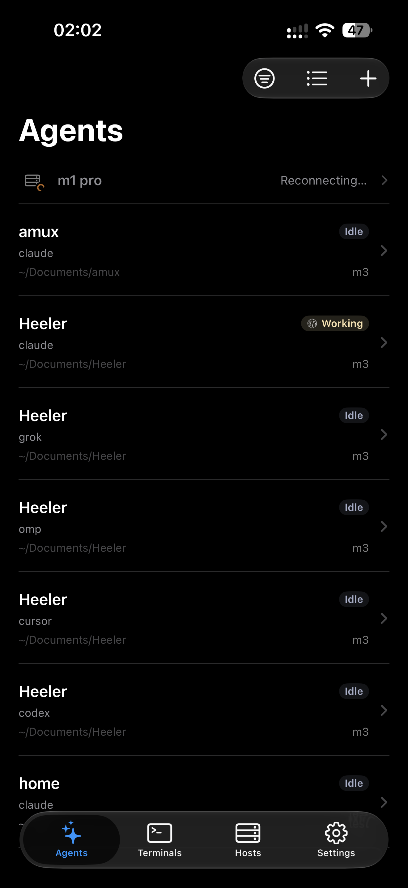
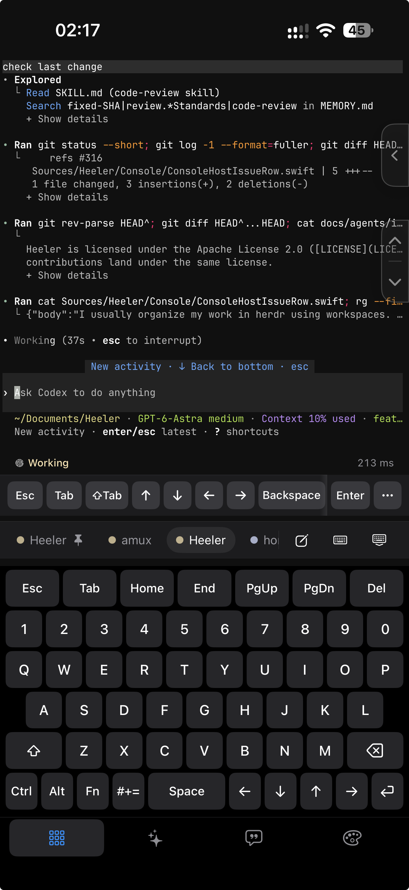
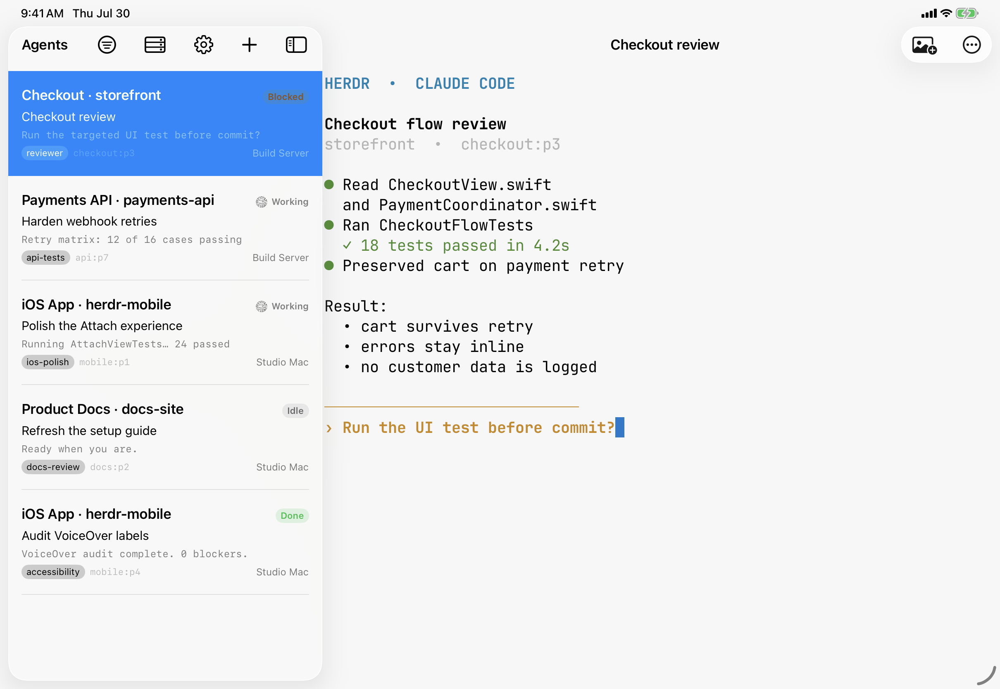

# Heeler

A native iOS companion app for [herdr](https://herdr.dev) — an agent-first terminal runtime.

Heeler is an **agent console**: a native dashboard of every coding agent running on your machines, sorted by who needs you. Open an Agent to enter its real terminal with the standard iOS input method, a compact terminal control keyboard, native scrollback, and continuous touch scrolling for full-screen TUIs, all over plain SSH.

## Screenshots

Agent Console on iPhone, with every Host and status in one priority-sorted view:



Attach on iPhone, rendering an Agent terminal through libghostty:



Agent Console and Attach together on iPad:



## Features

- **Console** — every Agent across your machines in one status-sorted list
  (who's Blocked comes first), filterable by Host, updating live off herdr's
  event stream.
- **Attach** — a real terminal (libghostty, Metal-rendered) with native
  scrollback, momentum touch scrolling that also drives full-screen TUIs,
  long-press selection, and IME input.
- **Attach Links** — silently collect web links to open or copy later.
- **Terminal keyboard** — a Keys pad with control keys, reusable Snippets, and
  appearance controls next to the standard iOS keyboard; multiline or control
  pastes go through review before they hit the shell; on-device dictation.
- **Image staging** — pick a photo, stage it onto the Host over SFTP, and hand
  its path to the Agent's prompt.
- **QR pairing** — add a machine by scanning a Pairing Code from the bundled
  herdr plugin; Ed25519 keys are generated on device and never leave the
  Keychain, and the code pins the host key fingerprint.
- **Agent Notifications** — end-to-end encrypted APNs pushes when an Agent
  goes Blocked or Done, deep-linking into its terminal; the relay sees the
  device token, source IP, request timing, and ciphertext, but cannot read the
  notification.
- **Worktrees** — start an Agent on a clean checkout of a workspace's repo
  with a toggle on the New Agent form.
- **Appearance** — 30 curated terminal themes with independent Light and Dark
  Mode slots, bundled monospace fonts, and pinch-to-zoom text size.
- **Jump Host** — reach machines that are not directly routable through an
  SSH jump, with keys verified independently at both hops.

## How it connects

The app speaks herdr's JSON API (newline-delimited JSON over a Unix socket) through SSH:

- **RPC + events**: an OpenSSH direct-streamlocal channel straight onto `herdr.sock` per request, plus one long-lived channel for `events.subscribe`.
- **Interactive terminal**: the Agent detail screen requests an SSH PTY and execs `herdr agent attach <pane>` on it, then renders it through a host-managed libghostty-spm session with Metal output, persistent appearance-aware themes, input-row keyboard activation, IME input, long-press text selection, and app-routed touch scrolling for both local scrollback and remote TUIs.

No herdr server changes and no extra packages required: SSH access plus a running herdr server is the whole prerequisite. The Host's SSH server does have to permit stream-local forwarding, which is the OpenSSH default; onboarding says so when it is turned off.

Hosts that are not directly reachable can be placed behind an SSH Jump Host.
The recommended deployment keeps the reverse-forwarded port on the VPS
loopback interface instead of publishing the Mac's SSH port.

- [Set up remote access step by step](docs/guides/vps-jump-host-setup.md)
- [Automate additional desktop-client enrollment](docs/guides/vps-jump-host-setup.md#automate-additional-desktop-clients)
- [Understand the architecture, security boundaries, and VPS migration runbook](docs/guides/vps-jump-host.md)

## Adding a machine: install the plugin, scan the code

The repo ships a [herdr plugin](plugin/README.md) that pairs the app with a
machine by QR code and delivers Agent Notifications over APNs. On the machine
running herdr (Node >= 20, herdr >= 0.7.5, OpenSSH server enabled — on macOS
that is **System Settings > General > Sharing > Remote Login**):

```bash
herdr plugin install ZingerLittleBee/Heeler/plugin --ref main --yes
herdr plugin action invoke heeler.pairing.pair
```

The `pair` action opens a popup with a Pairing Code QR; scan it with the app
and the machine is added as a Host — addresses, host key fingerprint, and SSH
key enrollment are all handled by the code, nothing to type. The same plugin
pushes encrypted Blocked/Done notifications to the app once you enable Agent
Notifications for the Host in the app's settings; the relay sees the device
token, source IP, request timing, and ciphertext, but cannot read the
notification (see [PRIVACY.md](PRIVACY.md)).

## Stack

- SwiftUI, iOS 26+, iPhone + iPad
- The repository-local `Packages/HeelerSSH` (libssh2 + OpenSSL) for SSH
- [libghostty-spm](https://github.com/lakr233/libghostty-spm) for terminal emulation and Metal rendering

See `docs/adr/` for why these choices were made (the transport story in particular is not obvious).

## Status

Pre-alpha. Personal-use first; not affiliated with the herdr project.
