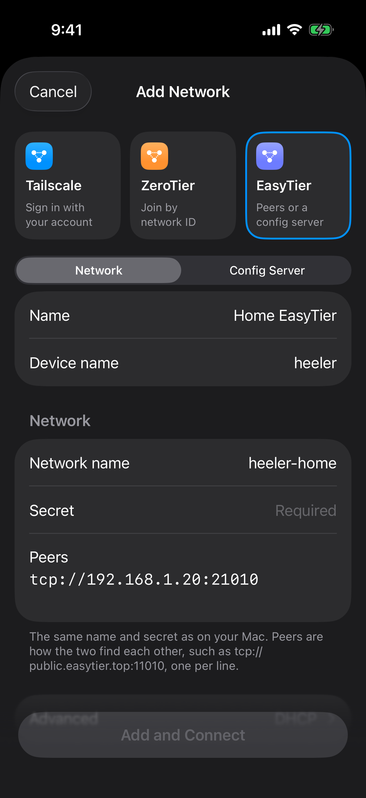

# EasyTier setup

Use EasyTier to reach a Mac running SSH and herdr from Heeler. Heeler contains its own EasyTier node, so the phone needs no other VPN app or system VPN. Use **Network** for a single Mac. Use **Config Server** when an administrator assigns networks to the phone from a web console.

The macOS commands were checked against the official **EasyTier v2.6.4** release on **2026-10-09**. On another release, check `easytier-core --version` and `--help` first. The Linux installer, `systemctl`, and `/dev/net/tun` instructions do not apply to macOS.

## Before you start

- Complete [Prepare the Host](overlay-networks.md#prepare-the-host): SSH, the login account, Heeler's authentication, and herdr.
- The phone must reach the Mac's EasyTier endpoint. The example uses a trusted LAN where the Mac is `192.168.1.20`; use your Mac's address from **System Settings > Network**.
- Pick an unused virtual subnet, a network name, and a strong secret. The examples use `10.144.144.0/24`, with `.2` for the Mac and `.3` for Heeler.
- Keep the Mac awake and the EasyTier process running during setup.

| Input | Example | Used in |
| --- | --- | --- |
| Network name | `heeler-home` | Mac and Heeler, identical |
| Network secret | Your shared secret | Mac and Heeler, identical; not the SSH password |
| EasyTier listener | `tcp://192.168.1.20:21010` | Heeler's **Peers** |
| Mac virtual address | `10.144.144.2/24` | Mac peer; the Host address is `10.144.144.2` |
| Heeler virtual address | `10.144.144.3/24` | Heeler's **Advanced > Fixed IPv4** |

The phone enters EasyTier through TCP `21010` and reaches SSH inside the virtual network. You never forward public TCP `22` to the Mac.

## Install the macOS CLI

Download the ZIP for your Mac from the [v2.6.4 release](https://github.com/EasyTier/EasyTier/releases/tag/v2.6.4): `easytier-macos-aarch64-v2.6.4.zip` for Apple Silicon, `easytier-macos-x86_64-v2.6.4.zip` for Intel. Extract it anywhere you control; it contains `easytier-core`, `easytier-cli`, and the web console ([installation guide](https://github.com/EasyTier/easytier.github.io/blob/main/en/guide/installation.md)).

```sh
ET_BIN="$HOME/Downloads/easytier-macos-aarch64"
"$ET_BIN/easytier-core" --version
```

Expect `2.6.4`. If macOS blocks the binary, check its origin and approve that app only; never turn off system protection globally. The release's macOS DMG is a graphical alternative, but its TUN setup needs different permissions and routes than this guide.

## Network: connect directly to the Mac

### 1. Check local SSH

On the Mac, confirm SSH listens on IPv4 loopback:

```sh
nc -vz 127.0.0.1 22
```

If SSH uses another port, use it here and in the Host form.

### 2. Start a Mac peer without a TUN device

Enter the secret at a prompt so it stays out of shell history (zsh syntax), then start the peer. Keep the same secret in your password manager for Heeler.

```zsh
read -rs 'ET_NETWORK_SECRET?EasyTier network secret: '
printf '\n'
export ET_NETWORK_SECRET
ET_LISTEN_HOST=192.168.1.20

"$ET_BIN/easytier-core" \
  --network-name heeler-home \
  --hostname heeler-mac \
  --ipv4 10.144.144.2/24 \
  --listeners "tcp://$ET_LISTEN_HOST:21010" \
  --rpc-portal 127.0.0.1:15888 \
  --no-tun \
  --private-mode true \
  --disable-upnp \
  --disable-p2p \
  --accept-dns false
```

Set `ET_LISTEN_HOST` to your Mac's address first. If the macOS firewall asks, allow incoming connections for this peer. Keep logs private; they can contain connection settings.

This runs without `sudo`, creates no TUN interface, and leaves DNS alone. It uses only the explicit TCP listener, without P2P discovery or UPnP. In [no-TUN mode](https://github.com/EasyTier/easytier.github.io/blob/main/en/guide/network/no-root.md), peers reach the Mac's virtual address, but other Mac apps cannot reach remote virtual addresses.

No `--port-forward` is needed. The [v2.6.4 TCP proxy](https://github.com/EasyTier/EasyTier/blob/v2.6.4/easytier/src/gateway/tcp_proxy.rs#L765) sends TCP for the node's own virtual address to `127.0.0.1` on the same port, so `10.144.144.2:22` reaches `127.0.0.1:22`. Other loopback services are reachable the same way, so treat network membership as access to the Mac, not to SSH alone.

For a Simulator on the same Mac, you can listen on `127.0.0.1` and use `tcp://127.0.0.1:21010` as its peer. A physical iPhone cannot; its `127.0.0.1` is the phone.

### 3. Add the network in Heeler

Open **Settings > Overlay Networks > Add Network**, choose **EasyTier**, and keep **Network** selected:

| Field | Value |
| --- | --- |
| Name | `Home EasyTier` |
| Device name | How Heeler appears to peers; defaults to `heeler` |
| Network name | `heeler-home` |
| Secret | The Mac's secret |
| Peers | `tcp://192.168.1.20:21010`, with your Mac's address |
| Advanced > Fixed IPv4 | `10.144.144.3/24` |

<a href="images/overlay-networks/easytier-manual-form.png"></a>

Tap **Add and Connect**. The network's screen opens and connects, and the Mac appears as a peer at `10.144.144.2`.

Leaving Fixed IPv4 blank uses DHCP; fixed addresses just make this example predictable. Include the prefix and avoid `/32`, which EasyTier treats as part of a `/24`. **Peers** accepts `tcp://` and `udp://` endpoints. A peer's virtual address is not a bootstrap endpoint.

### 4. Add and verify the SSH Host

Tap **Add** on the Mac's peer row, or follow [Connect from Heeler](overlay-networks.md#connect-from-heeler) with **Home EasyTier** as the Network. Use `10.144.144.2`, port `22`, the Mac's login account, and no Jump Host.

Saving starts the Host checks. Verify the SSH fingerprint before tapping **Trust**, then complete [Verify the connection](overlay-networks.md#verify-the-connection).

To inspect the peer from the Mac, open a second Terminal, set `ET_BIN` again, and run:

```sh
"$ET_BIN/easytier-cli" -p 127.0.0.1:15888 node
"$ET_BIN/easytier-cli" -p 127.0.0.1:15888 peer
"$ET_BIN/easytier-cli" -p 127.0.0.1:15888 route
```

Expect the Mac at `.2` and Heeler at `.3`. A peer entry does not prove SSH or herdr work. Without a TUN, `ssh` or `ping` from the Mac to a virtual address cannot stand in for Heeler's checks.

### Reaching a Mac outside the LAN

A LAN address works only where the phone can reach that LAN. Elsewhere, expose a reachable EasyTier TCP endpoint, or use a relay both devices can reach. For a relay, add `--peers tcp://YOUR_RELAY:PORT` to the Mac command and put the same endpoint in Heeler's **Peers**. Use a relay you run or are allowed to use ([shared-node guide](https://github.com/EasyTier/easytier.github.io/blob/main/en/guide/network/quick-networking.md)). `--disable-p2p` keeps traffic on these explicit connections. A Config Server delivers settings but is not a relay.

## Config Server: assign the phone a network from a web console

Here an administrator supplies the network settings instead of you typing them. The Mac can keep running the peer from above; the console assigns Heeler's Machine ID a network with that name, secret, and peer endpoint.

### 1. Choose or start a configuration server

Get the **configuration URL**, including the account name, from the server's administrator; the web console's URL is a different address. Heeler accepts `tcp://host:port/USER`, `udp://host:port/USER`, and `wss://host/path/USER`.

A bare user name expands to `udp://config-server.easytier.cn:22020/USER`. As of 2026-10-09, the EasyTier project [no longer runs its own hosted service](https://github.com/EasyTier/easytier.github.io/blob/main/.vitepress/components/WebRedirect.vue), so enter the full URL from your operator.

To self-host a trial on a trusted LAN, run `easytier-web-embed` from the same archive:

```sh
ET_WEB_DATA="$HOME/Library/Application Support/Heeler-EasyTier-Console"
mkdir -p "$ET_WEB_DATA"
chmod 700 "$ET_WEB_DATA"
umask 077

"$ET_BIN/easytier-web-embed" \
  --db "$ET_WEB_DATA/et.db" \
  --config-server-port 22550 \
  --config-server-protocol tcp \
  --api-server-port 11750 \
  --api-server-addr 127.0.0.1 \
  --web-server-addr 127.0.0.1 \
  --api-host http://127.0.0.1:11750 \
  --console-log-level warn
```

Open `http://127.0.0.1:11750` on the Mac, register an account, solve the CAPTCHA, and sign in. The release also creates default accounts; change their passwords before anyone else can reach the console ([web console guide](https://github.com/EasyTier/easytier.github.io/blob/main/en/guide/network/web-console.md)).

The web UI and API stay on loopback, but **v2.6.4 binds configuration port `22550` on every interface** and has no option to change that ([source](https://github.com/EasyTier/EasyTier/blob/v2.6.4/easytier-web/src/main.rs#L206)). Limit who can reach it with your firewall. A physical phone uses the Mac's address, such as `tcp://192.168.1.20:22550/USER`; only a Simulator on this Mac can use `127.0.0.1`.

### 2. Register Heeler's device

In **Settings > Overlay Networks > Add Network**, choose **EasyTier > Config Server**. Enter a Name, the full configuration URL as **Server**, and a recognizable **Device name**. Leave **Advanced** at **Encryption required**. Copy the **Machine ID** to find this device in the console, then tap **Add and Connect**.

<a href="images/overlay-networks/easytier-config-server-form.png"></a>

While it reaches the server, the network shows **Connecting…** with the server's host. Next it shows **Waiting for a network**, with the Machine ID on the status card. In the console, find the device by name and Machine ID. Being listed there does not yet give it an address or a route.

Required encryption uses EasyTier's Noise handshake, which encrypts the session but does not authenticate a `tcp://` or `udp://` server; the form warns about this. On networks you don't trust, use a `wss://` URL with a certificate the phone trusts. Heeler rejects untrusted and self-signed certificates, and `ws://` would expose the account token. Fix the server instead of turning encryption off. The server can read the network secrets it hands out. Details: [Heeler's Config Server contract](../../Packages/HeelerOverlay/README.md#config-servers).

### 3. Assign and run an instance

On the device's page in the console, create a network instance:

| Console setting | Value |
| --- | --- |
| Network name | `heeler-home` |
| Network secret | The Mac's secret |
| DHCP | Off |
| Virtual IPv4 | `10.144.144.4` |
| Network prefix | `24` |
| Networking method | Manual |
| Peer URL | `tcp://192.168.1.20:21010`, the Mac's listener |
| Traffic encryption | On |

`.4` avoids clashing with the `.3` of a Network entry that may also be connected. Save the instance **and run it**; a saved, stopped instance does nothing ([console source](https://github.com/EasyTier/EasyTier/blob/v2.6.4/easytier-web/frontend-lib/src/components/RemoteManagement.vue#L209)). Don't add inbound proxies, credential files, or disabled encryption for the phone. Heeler drops listeners from the console and connects only outward.

Back in Heeler, the network shows **Connected**, the assigned network with its address, and the Mac as a peer. Add the Mac as a Host, or switch an existing Host's Network to this entry; the address stays `10.144.144.2`. Complete [Verify the connection](overlay-networks.md#verify-the-connection). To prove this route carries the traffic, disconnect the Network entry first.

Heeler takes up to eight assigned networks. Give them distinct names and subnets: a Host picks the network that holds its address, and an ambiguous match fails. The network's screen marks any assigned network that cannot run, with the reason. Resetting the Machine ID creates a new device that needs a new assignment.

## Troubleshooting

| Symptom | Check |
| --- | --- |
| No Mac peer | Name and secret match; the peer URL has the listener's protocol, address, and port. Check the Mac process, LAN isolation, and firewall. |
| Works in the Simulator, not on a phone | Replace `127.0.0.1` with the Mac's reachable address, for both the peer and the configuration URL. |
| Connected, but SSH fails | Check `127.0.0.1:22` on the Mac, the Host's address and port, the account, the key, and the fingerprint. Read the failing Host check. |
| Config Server stays **Connecting…** or **Waiting for a network** | Check the full URL and account, the Machine ID, encryption support, and that the instance is assigned and running. A working web page proves only the web service. |
| An assigned network is **Not running** | Read its reason: duplicate names, inbound settings, disabled encryption, or more than eight networks. |
| Several assigned networks match the Host | Give them distinct subnets in the console; Heeler's display name does not disambiguate. |
| Port already in use | Stop the earlier EasyTier process, or give each one its own listener and RPC ports and update **Peers**. |
| Mac apps cannot reach virtual peers | Expected without a TUN. Test through Heeler, or set up TUN, SOCKS, or port forwarding on purpose. |
| Connection ends after backgrounding or peer loss | Restore the peer, return to Heeler, and use the Host's Reconnect or the terminal's Reattach. |

An assigned network can keep working while the configuration server is down, but a fresh launch or an unassigned device needs the server.

## Stop or remove this setup

Turning off the network's switch disconnects it and keeps its settings; a Host can still connect it again. To retire it, move or remove its Hosts first, then delete the network.

On the Mac, press **Control-C** in the peer and web console Terminals, then run `unset ET_NETWORK_SECRET`. This guide installed no boot service. Deleting the console database loses its accounts and assignments. Remove only the firewall rules and SSH keys you added for this setup.

To run EasyTier at startup, follow the [macOS service guide](https://github.com/EasyTier/easytier.github.io/blob/main/en/guide/network/install-as-a-macos-service.md) with your verified settings. TUN mode and system daemons are separate choices from this guide's no-TUN setup.

## References

EasyTier sources checked on 2026-10-09:

- [v2.6.4 release](https://github.com/EasyTier/EasyTier/releases/tag/v2.6.4).
- [Installation](https://github.com/EasyTier/easytier.github.io/blob/main/en/guide/installation.md), [no-TUN mode](https://github.com/EasyTier/easytier.github.io/blob/main/en/guide/network/no-root.md), and [shared-node networking](https://github.com/EasyTier/easytier.github.io/blob/main/en/guide/network/quick-networking.md).
- [Web console](https://github.com/EasyTier/easytier.github.io/blob/main/en/guide/network/web-console.md) and [hosted-service notice](https://github.com/EasyTier/easytier.github.io/blob/main/.vitepress/components/WebRedirect.vue).
- [TCP proxy](https://github.com/EasyTier/EasyTier/blob/v2.6.4/easytier/src/gateway/tcp_proxy.rs#L765), [configuration listener](https://github.com/EasyTier/EasyTier/blob/v2.6.4/easytier-web/src/main.rs#L206), and [Noise transport](https://github.com/EasyTier/EasyTier/blob/v2.6.4/easytier/src/web_client/security.rs).

For test coverage and source references, see [guide maintenance](../agents/overlay-network-guides.md).
