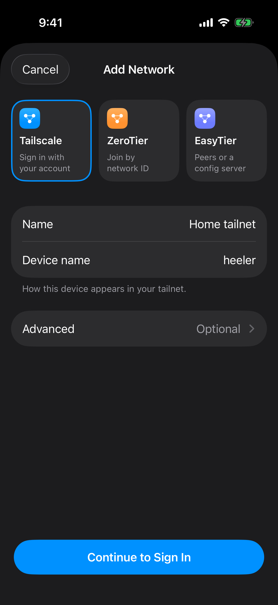

# Connect Through Tailscale

This guide reaches a Mac running herdr through Tailscale's standard macOS app. Heeler joins the same tailnet with its own in-app node, so the phone needs no Tailscale app or VPN.

You need a Heeler build with [PR #426](https://github.com/ZingerLittleBee/Heeler/pull/426), a Tailscale account, and permission to add devices to the tailnet. To keep the Mac free of a network extension and TUN interface, use [Tailscale in userspace mode](tailscale-userspace.md) instead.

## 1. Prepare the Mac

Complete [Prepare the Host](overlay-networks.md#prepare-the-host). This guide uses the Mac's own SSH server; Tailscale SSH (`tailscale up --ssh`) is not needed.

## 2. Install the macOS app and join the tailnet

1. Install the **Standalone** app from [Install Tailscale on macOS](https://tailscale.com/docs/install/mac) and open it. The userspace guide covers the Homebrew CLI.
2. Allow the network extension and VPN configuration when asked. On macOS 15 and later, turn on **Tailscale Network Extension** in **System Settings → General → Login Items & Extensions → Network Extensions**. For older macOS, see the [extension instructions](https://tailscale.com/docs/concepts/macos-sysext).
3. Sign in from the menu bar app. If the tailnet requires device approval, approve the Mac.
4. In the [admin console](https://login.tailscale.com/admin/machines), note the Mac's Tailscale IPv4 address and machine name.

The standalone app routes tailnet traffic for every Mac app, while Heeler's node serves only Heeler. See [macOS variants](https://tailscale.com/docs/concepts/macos-variants).

## 3. Join the same tailnet from Heeler

In **Settings → Overlay Networks → Add Network**, choose **Tailscale**:

| Field | Value |
| --- | --- |
| Name | A label such as `Home tailnet` |
| Device name | How Heeler appears in the tailnet; defaults to `heeler` |
| Advanced | Leave blank for browser sign-in |

Tap **Continue to Sign In**. Heeler opens the network and starts browser sign-in. Sign in to the Mac's tailnet, then return to Heeler; it connects on its own. If the tailnet requires approval, the network shows **Waiting for approval** until an admin approves it. If you leave the browser without signing in, the network shows **Sign in to Tailscale**; tap **Sign In with Browser** to try again.

To skip the browser, enter an auth key from your tailnet admin under **Advanced**; the button becomes **Add and Connect**, and Heeler keeps the key in the Keychain. For Headscale, enter its HTTPS URL as the **Coordination server**.

Heeler is its own device in the tailnet, separate from any Tailscale app on the phone. Once **Connected**, the network's screen shows Heeler's address and the machines it can see. The tailnet's grants or ACLs must still allow Heeler to reach the Mac's TCP port 22.

## 4. Add the Mac as a Host

Follow [Connect from Heeler](overlay-networks.md#connect-from-heeler). Select the network under **Network**, then use **Choose from Tailnet…** and pick the Mac's **IP Address** (**Machine Name** also works). You can also tap **Add** beside the Mac on the network's screen.

Use port `22`, the Mac's SSH account, the authentication you prepared, and no Jump Host. Save, verify the fingerprint, and let the checks finish.

## 5. Verify and maintain the connection

Complete [Verify the connection](overlay-networks.md#verify-the-connection), including a test over cellular. Keep the Mac awake and connected to Tailscale.

| Symptom | Check |
| --- | --- |
| The Mac is missing from the picker | Both devices are in the same tailnet, approved, and allowed to see each other. Try the Mac's Tailscale IPv4 directly. |
| SSH times out | The Mac is awake and connected, and policy allows TCP 22 from Heeler. |
| SSH authentication fails | Use the Mac's local account with its authorized key or password; Tailscale sign-in is not SSH authentication. |
| SSH works, herdr checks fail | Recheck herdr's installation, PATH, and session in [Prepare the Host](overlay-networks.md#prepare-the-host). |
| **Signed out** or **Sign in to Tailscale** | Open the network and tap **Sign In with Browser**. |

**Sign Out** in Heeler signs out only Heeler's node, never the Mac. A Host that is reconnecting can race with it, so to revoke access, remove Heeler's device in the admin console and retire its auth key, if any. Heeler stops its node after the Background Grace Period and rebuilds it when you return. Notifications use the Push Relay and do not depend on this connection.

Official documentation and Heeler's form labels were checked on **2026-10-09**. See the [verification scope](../agents/overlay-network-guides.md#verification-scope).
