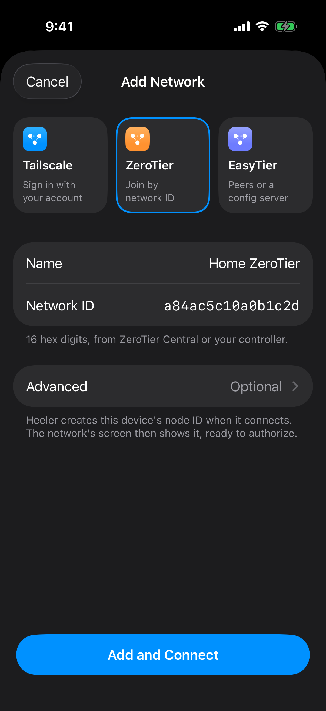

# Connect Heeler through ZeroTier

This guide reaches a Mac running herdr through a private ZeroTier Central network. The Mac runs ZeroTier One, which adds a virtual network interface with the network's managed addresses and routes. Heeler runs its own ZeroTier node, so the phone needs no ZeroTier app or VPN.

You need a Heeler build with [PR #426](https://github.com/ZingerLittleBee/Heeler/pull/426). Read [Overlay Networks](overlay-networks.md) first for the shared SSH setup.

**Userspace alternative:** ZeroTier's official [Sockets SDK (libzt)](https://docs.zerotier.com/sockets/), also used inside Heeler, supports app-level networking without changing system interfaces, routes, or DNS. Using it for SSH on the Mac requires your own forwarding program; installing the SDK alone is not enough.

## Before you start

- You need admin access to the Mac, a Central account that can manage the network, and Heeler on the phone.
- Complete [Prepare the Host](overlay-networks.md#prepare-the-host): Remote Login, herdr, a Device Key, and the Mac's host-key fingerprint.
- Keep the Mac awake and Heeler in the foreground during setup. Both need internet access to ZeroTier's roots and the controller.
- Use a private network with manual authorization and an IPv4 range that does not overlap the Mac's LAN or existing VPN routes. Leave custom Planet and Moons empty.

A node ID names a device and a network ID names the network. Neither is the address SSH uses.

| Value | Where to find it | Used for |
| --- | --- | --- |
| `ZT_NETWORK_ID` | Central's network page, 16 hex digits | Joining on both devices |
| Mac node ID | `zerotier-cli info`, 10 hex digits | Authorizing the Mac |
| Heeler node ID | **This device** on Heeler's network status card, 10 hex digits | Authorizing Heeler |
| Mac managed IP | Central's member list or `zerotier-cli listnetworks` | Host address, without the `/prefix` |

## 1. Central: create a private network

[New Central](https://central.zerotier.com/) and [Legacy Central](https://my.zerotier.com/) differ:

| Console | Create or select a network | Authorize a device |
| --- | --- | --- |
| New Central | Select your organization's default network, or **Networks > New Network**. | In **Member Devices**, find its node ID and choose **Actions > Authorize**. |
| Legacy Central | **Networks > Create A Network**, then open it. | In **Members**, find its **Address** and check **Auth?**. |

Keep the network private (Legacy Central: **Access Control > Private**) and keep a managed IPv4 pool with its matching route. Copy the 16-digit network ID generated when the network was created; use the same ID on the Mac and in Heeler. See ZeroTier's [network guide](https://docs.zerotier.com/networks/) for each console's settings.

## 2. Mac: install ZeroTier One and join

Install ZeroTier One from the [download page](https://www.zerotier.com/download/) and accept its macOS prompts. Join from the menu bar's **Join New Network…** (see the [quickstart](https://docs.zerotier.com/quickstart/)) or in Terminal:

```sh
ZT_NETWORK_ID='YOUR_16_HEX_NETWORK_ID'
sudo zerotier-cli info
sudo zerotier-cli join "$ZT_NETWORK_ID"
sudo zerotier-cli listnetworks
```

`info` prints the Mac's node ID. `join` only sends the request; `listnetworks` shows the actual state ([CLI reference](https://docs.zerotier.com/cli/)).

In Central, authorize the member with the Mac's node ID and give it a name. Run `listnetworks` again.

**Checkpoint:** the network shows `OK PRIVATE` with a managed address such as `10.147.17.2/24`, so the Host address is `10.147.17.2`. `ACCESS_DENIED` means the Mac is not authorized yet ([walkthrough](https://docs.zerotier.com/start/)).

## 3. Heeler and Central: join and authorize the app

<a href="images/overlay-networks/zerotier-form.png"></a>

1. In Heeler, open **Settings > Overlay Networks > Add Network** and choose **ZeroTier**.
2. Enter a **Name** and paste `ZT_NETWORK_ID` into **Network ID**. Leave **Advanced** (Moons and Planet) at its defaults.
3. Tap **Add and Connect**, then copy the node ID under **This device** on the status card. While **Waiting for authorization**, tap **Open ZeroTier Central** (available with the default roots).
4. In Central, authorize the member with Heeler's node ID. Authorizing the Mac does not authorize Heeler. Heeler connects once it is authorized; if the attempt has already ended, turn the network's switch back on.

Heeler uses one ZeroTier identity for all its ZeroTier networks, separate from any other ZeroTier app on the phone, and keeps its private key in the Keychain.

**Checkpoint:** Heeler shows **Connected** with its own address, and Central lists both devices as authorized. The next step uses the Mac's address, not Heeler's.

## 4. Heeler: add the Mac as a Host

Follow [Connect from Heeler](overlay-networks.md#connect-from-heeler) with these values:

| Host field | Value |
| --- | --- |
| Network | The ZeroTier network you just connected |
| Address | The Mac's managed IP, without the `/prefix` |
| Port | The Mac's SSH port, normally `22` |
| User and authentication | The account and Device Key from the shared guide |
| Jump Host | Blank |

Heeler's ZeroTier node takes IP addresses (IPv4 or IPv6), not DNS names. The **Members** list and the **Roots** in **Diagnostics** show transport paths, often public IPs and ports; they are not Host addresses, so ZeroTier has no address picker. Touch and hold a member to copy its node ID or path.

Verify the fingerprint, let the Host checks finish, and complete [Verify the connection](overlay-networks.md#verify-the-connection). To tell a Mac SSH problem from a Heeler problem, try `ssh -p <SSH_PORT> <SSH_USERNAME>@<MAC_MANAGED_IP>` from another computer already on the network ([remote access guide](https://docs.zerotier.com/remotedesktop/)).

## Troubleshooting

| Symptom | Check |
| --- | --- |
| Heeler cannot save the network | Paste the 16-digit network ID, not a 10-digit node ID. Remove incomplete Moon rows. |
| **Waiting for authorization**, or `ACCESS_DENIED` on the Mac | Authorize that exact node ID on the intended network. Each device needs its own authorization. |
| `REQUESTING_CONFIGURATION` on the Mac, or Heeler times out without an address | Check the network ID, internet access, and controller reachability. Heeler's **Diagnostics** shows the joined state, addresses, and root activity. |
| Authorized, but no managed IPv4 | Check the address pool and its route in Central, and use the address actually assigned to the Mac. |
| `PORT_ERROR` on the Mac | Check the client's network permissions with ZeroTier's [macOS troubleshooting](https://docs.zerotier.com/faq/macos-porterror/); its screenshots may predate your macOS. |
| Connected, but SSH fails | Confirm the Host uses the Mac's managed IP and this network, then check Remote Login, account, port, firewall, and Device Key. |
| **No Members Yet** | Members appear only after traffic with them. Try the Host connection with the managed IP from Central. |
| Disconnected after backgrounding Heeler | Return to Heeler and let the Host reconnect; the in-app node is not an always-on VPN. |

If the CLI cannot read the auth token, run it with `sudo` as an administrator and keep `authtoken.secret` private. Remove addresses and IDs you don't want to share from diagnostics.

## Advanced: Planet and Moon settings

Not needed for Central. **Import Planet File…** takes an operator's planet file of up to 16 KB (moon files are rejected). **Add Moon** takes a nonzero 10-to-16-digit hex World ID and a nonzero 10-digit root node Seed.

Known limitation: a new Heeler process first contacts ZeroTier's official roots before it installs a network's custom Planet or Moons. If only private roots are reachable, the first connect can time out. Treat deployments that must work without the official roots as unsupported until this is fixed and verified.

Custom roots join one root set shared by every ZeroTier network in Heeler, so a per-network Planet does not keep its roots private. See [ADR 0021](../adr/0021-in-process-overlay-networks.md).

## Stop using the network

Turning off the network's switch disconnects it but keeps its settings and node ID; a Host can still connect it again. To retire it, move or remove its Hosts first, then delete the network. Deleting the last ZeroTier network also deletes Heeler's node ID.

On the Mac, leave only this network:

```sh
sudo zerotier-cli leave "$ZT_NETWORK_ID"
sudo zerotier-cli listnetworks
```

Disconnecting or deleting does not revoke access. Deauthorize the Mac or Heeler member in Central for that. Leave other networks and members untouched.

## References

ZeroTier documentation checked on **2026-10-09**: [Quickstart](https://docs.zerotier.com/quickstart/), [Networks](https://docs.zerotier.com/networks/), [Create a Network](https://docs.zerotier.com/start/), [CLI](https://docs.zerotier.com/cli/), [macOS](https://docs.zerotier.com/macos/), and [Remote Desktop / SSH](https://docs.zerotier.com/remotedesktop/).

For test coverage and source references, see [guide maintenance](../agents/overlay-network-guides.md).
